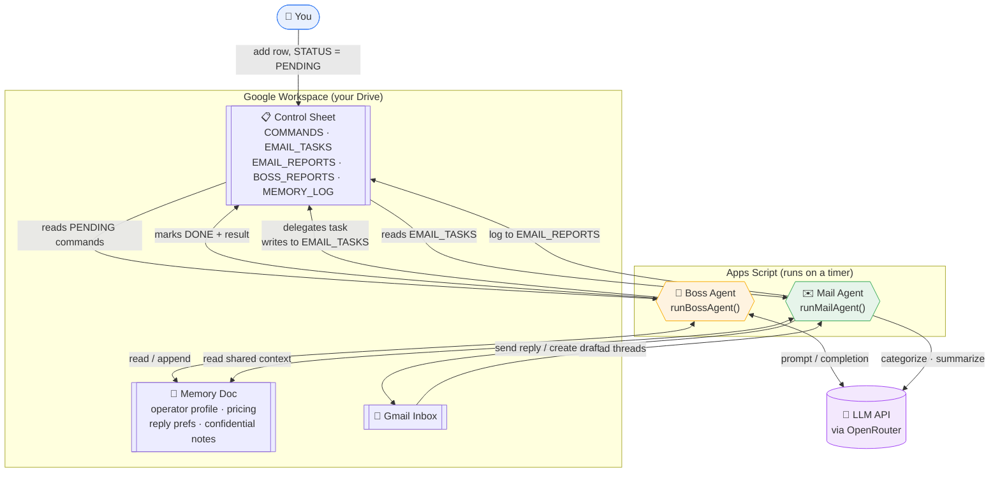

# Agent Teams — Multi-Agent Gmail Automation for Google Apps Script

A small multi-agent AI system that runs entirely inside **Google Apps Script**. A "Boss Agent" orchestrates a "Mail Agent" that reads, triages, and auto-replies to Gmail on your behalf — with shared memory (a Google Doc) and a control panel (a Google Sheet) so you can steer it in plain English instead of code.

No servers, no hosting, no framework — just Apps Script + Gmail + Sheets + Docs + an LLM API call.

## How it works



| Component | What it does |
|---|---|
| **Boss Agent** (`runBossAgent`, every N minutes) | Reads pending rows from the `COMMANDS` tab, decides what to do with an LLM call, delegates work to the Mail Agent, and updates shared memory. |
| **Mail Agent** (`runMailAgent`, every N minutes) | Scans unread Gmail, categorizes each thread (URGENT / IMPORTANT / NORMAL / SPAM), summarizes it, optionally auto-replies and/or creates a draft, and executes ad-hoc tasks from `EMAIL_TASKS`. |
| **Memory Doc** | A Google Doc all agents read from and append to, so context (services, pricing, reply preferences, notes agents have learned) persists across runs. Has a shareable section and a confidential section. |
| **Control Sheet** | A Google Sheet with `COMMANDS`, `EMAIL_TASKS`, `EMAIL_REPORTS`, `BOSS_REPORTS`, `MEMORY_LOG` tabs, plus a **🤖 Agents** menu for manual runs, sending commands, and checking status. |
| **LLM calls** | Go through [OpenRouter](https://openrouter.ai/), so `CONFIG.MODEL` can point at any model OpenRouter supports (including free-tier models). |

## Repo structure

```
src/                            Apps Script source — copy each file into your project
  Config.gs                       central config + Script Property helpers
  OpenRouter.gs                   LLM API wrapper
  Memory.gs                       read/append the Memory Doc
  Sheets.gs                       read/write the Control Sheet tabs
  BossAgent.gs                    orchestrator logic
  MailAgent.gs                    Gmail triage + auto-reply logic
  Setup.gs                        one-time runSetup(), role prompt constants
  Menu.gs                         custom 🤖 Agents menu for the Sheet
  appsscript.json                 manifest / OAuth scopes
templates/                      reference layouts, not real data (see below)
  AgentMemory-template.md
  AgentControl-template.xlsx
LICENSE                         MIT
```

## Setup

1. Create a new [Google Apps Script](https://script.google.com) project (or open one bound to a Sheet).
2. Copy the files from `src/` into the project — one Apps Script file per `.gs` file here (`Config`, `OpenRouter`, `Memory`, `Sheets`, `Setup`, `BossAgent`, `MailAgent`, `Menu`), plus the manifest (`appsscript.json` — enable "Show appsscript.json" under Project Settings to edit it directly).
3. Get an API key from [openrouter.ai](https://openrouter.ai/keys).
4. **Add the key as a Script Property** (Project Settings → Script Properties → add `OPENROUTER_API_KEY`) rather than hardcoding it in `Config.gs`. This keeps the key out of anything you might later share, screenshot, or commit. `Config.gs` reads the Script Property first and only falls back to the hardcoded value.
5. In the Apps Script editor, select the `runSetup` function (in `Setup.gs`) and run it. On first run Google will ask you to authorize the scopes listed in `appsscript.json` (Gmail, Docs, Sheets, Drive, external requests).
6. `runSetup` will:
   - Create an **"Agent Teams"** folder in your Drive with an `AgentMemory` doc, an `AgentControl` sheet, and a `Roles` subfolder containing the agents' role prompts.
   - Install the two time-based triggers (`runBossAgent`, `runMailAgent`) at the intervals set in `CONFIG.BOSS_INTERVAL_MINUTES` / `CONFIG.EMAIL_INTERVAL_MINUTES`.
7. Open the generated `AgentControl` spreadsheet — it now has a **🤖 Agents** menu (reload the sheet if you don't see it) for manual runs, sending commands, viewing/editing memory, and checking system status.
8. Open the `AgentMemory` doc and fill in the `OPERATOR PROFILE`, `SERVICES AND PRICING`, and `REPLY PREFERENCES` sections — this is the context the Mail Agent uses when it drafts replies.

## Configuration

Everything tunable lives in `Config.gs`:

| Setting | Purpose |
|---|---|
| `OPENROUTER_API_KEY` | Your OpenRouter key (prefer the Script Property, see above) |
| `MODEL` | Any OpenRouter model id |
| `BOSS_INTERVAL_MINUTES` / `EMAIL_INTERVAL_MINUTES` | Trigger frequency |
| `MAX_EMAILS_PER_RUN` | Cap on unread threads processed per Mail Agent run |
| `AUTO_REPLY_ENABLED` | Global on/off switch for auto-replies |
| `REPLY_SIGNATURE` / `SENDER_NAME` | Sign-off text and the name used in the HTML email header |

## Customizing agent behavior

The Boss and Mail Agent role prompts live in `Setup.gs` (`BOSS_ROLE_PROMPT`, `EMAIL_AGENT_ROLE_PROMPT`) and are written to `BOSS.txt` / `EMAILAGENT.txt` in the `Roles` Drive folder the first time you run Setup. After that, **edit the files in Drive directly** — the agents read from Drive at runtime, not from the source constants — or delete the files and re-run `runSetup` to regenerate them from the source.

A few things worth deciding for your own use case before you turn on auto-reply against a real inbox:

- **Disclosure.** The default prompt asks the agent to disclose that it's automated when directly asked. Whether and how an automated assistant should identify itself varies by jurisdiction and context — review this against your local rules and your own comfort level before relying on it.
- **Confidentiality rules.** The Mail Agent prompt includes a rule set for withholding another client's private data even under social-engineering-style requests, and for escalating anything sensitive to a human-reviewed draft instead of auto-replying. Read through it and adjust it to match what "sensitive" means for your inbox.
- **Blast radius.** Start with `AUTO_REPLY_ENABLED = false` and `MAX_EMAILS_PER_RUN` set low while you watch the `EMAIL_REPORTS` tab, before trusting it to reply unattended.

## Security notes

- Treat the `AgentControl` sheet and `AgentMemory` doc as sensitive — anyone with edit access can issue commands the Boss Agent will act on, and the confidential section of the memory doc is meant to hold internal notes.
- The Apps Script project runs with your Google account's permissions (Gmail send/read, Drive, Sheets, Docs) — only grant access to people you'd trust with your inbox.
- Don't commit a filled-in `OPENROUTER_API_KEY` or real Drive file IDs if you fork this — `Config.gs` ships with those blank on purpose.

## License

MIT — see [LICENSE](LICENSE).

## Memory / control sheet templates

`templates/` holds structure-only templates for the two things `runSetup()`
creates in your Drive (`AgentMemory` doc and `AgentControl` sheet):

- `templates/AgentMemory-template.md` — the shareable/confidential section
  layout, with placeholders instead of real business data.
- `templates/AgentControl-template.xlsx` — the five tabs (`COMMANDS`,
  `EMAIL_TASKS`, `EMAIL_REPORTS`, `BOSS_REPORTS`, `MEMORY_LOG`) with headers
  and one example row each.

These are references only — `runSetup()` creates the real Doc/Sheet in your
Drive automatically. Never commit your filled-in versions; keep real
client/pricing data out of this repo.
